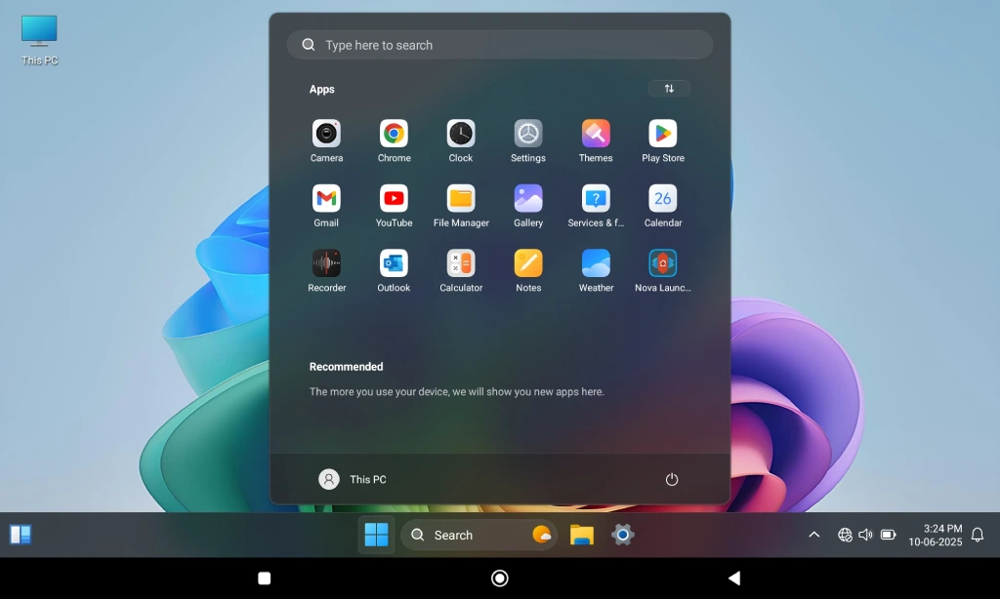
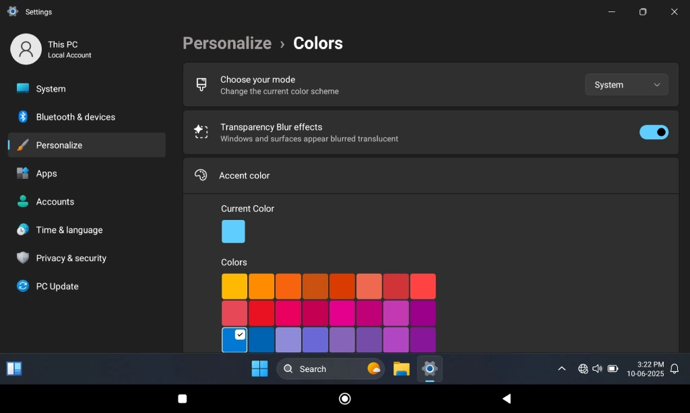
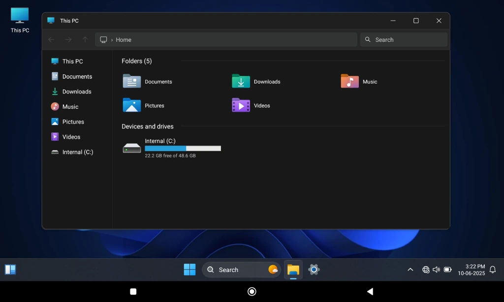
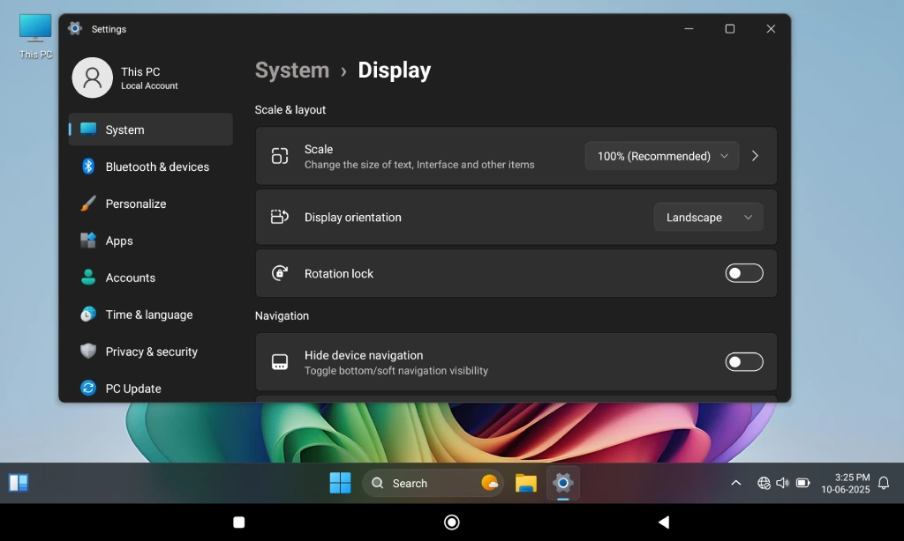

# HyperDroid - PC Launcher
Native desktop experience on your android device.

## Get

<table>
  <thead>
    <tr>
      <th colspan="2">Screenshots</th>
    </tr>
  </thead>
  <tbody>
    <tr>
      <td style="text-align: center;">
        
      </td>
      <td style="text-align: center;">
        
      </td>
    </tr>
    <tr>
      <td style="text-align: center;">
        
      </td>
      <td style="text-align: center;">
        
      </td>
    </tr>
  </tbody>
</table>

## Features

### ✨ **User-Friendly Interface**  
Intuitive desktop-style interface optimized for both touch input and external peripherals (keyboard, mouse, etc.).

### 🪟 **Floating Window Support**  
Launch installed WebApps in resizable, floating windows for enhanced multitasking.

### ⚙️ **Customizable Display Density**  
Adjust screen scaling to suit your preferences and display size.

### 🌍 **Multi-Language Support**  
Available in multiple languages to ensure a more accessible experience for all users.

### 📁 **Built-in File Manager**  
Manage your files easily with a clean and user-friendly file explorer.

### 🎨 **Editable App Icons and Names**  
Personalize your experience by renaming apps and changing their icons.

### 📱 **Set as Default Launcher**  
Optionally set **HyperDroid** as your system’s default launcher for seamless integration.

## Links

